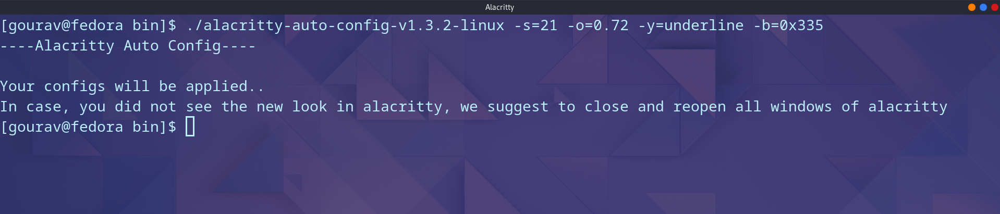

# Alacritty Auto Config

[](./LICENSE.md)

**Check out the npm package in the npm repository [here](https://www.npmjs.com/package/alacritty-auto-config).**

**[Download the stable release executables from SourceForge.net..](https://sourceforge.net/projects/alacritty-auto-config/)**

This is a small npm library, which helps you configure Alacritty with ease. It provides both the CLI options and the npm package, which can be used to extend its functionality in any project you create.




## NPM Package Installation & Execution

### Install the npm package

For windows users, please run the package to see if the configurations actually work or not. I am unable to test it out on windows platform.

Install the package globally:

```sh
npm install -g alacritty-auto-config
```

**Note: Run the above command with sudo if you are on mac or linux**

Install the package locally:

```sh
npm install alacritty-auto-config
```

### Run the npm package binary in the CLI

**Before running anything, make sure your alacritty.yml file (if it exists) is backed up, as it may overwrite some configurations in the alacritty.yml file as per your inputs in the CLI/API.**

For global install:

```sh
alacritty-auto-config [options]=[values]
```

Or,

```sh
aac [options]=[values]
```

For local install of that npm package, just run the above commands on terminal prefixed with `npm` like mentioned below.

Ex-

```sh
npx alacritty-auto-config [options]=[values]
```

- Show Help:

```sh
aac -h
```

Or,

```sh
aac --help
```

- Options:

```sh
-s, --fontsize: Takes font size to be set in alacritty (default=10)
-b, --bgcolor: Takes primary background color in '#xxxxxx' or '#xxx' or '0xfff' or '0xffffff' format (default='#333333')
-c, --fgcolor: Takes primary foreground color in '#xxxxxx' or '#xxx' or '0xfff' or '0xffffff' format (default='#ffffff')
-t, --selcolor: Takes text color (when the area is selected) in '#ffffff' or '#fff' or '0xfff' or '0xffffff' format (default='#111122')
-y, --cursor: Takes cursor style that can be Block or Underline or Beam (default=Block)
-o, --opacity: Takes background opacity which is between 0.0 (transparent) and 1.0 (opaque) (default=1)
-v, --version: Show version number
```

## Project Scripts

### Install and Build the project

```sh
npm install
npm run build
```

### Generate executables

```sh
npm run generate-binary
```

**The generate-binary script will build the dist folder and generate the binary files for each major OS platforms.** All the executables will be present in the dist/bin folder.

### Run the development watch mode

**This watch mode watches continuously for the typescript files**

```sh
npm run dev
```

### Extra Notes after you build this project yourself

The above options and values are also valid, if you build the project yourself, and run the output file with those options.

Run the below scripts from the project root folder:

```sh
node dist/esm/index.mjs [options]=[values]
```

Or,

```sh
node dist/cjs/index.cjs [options]=[values]
```

### Supported NPM Package export types to be imported in your project

- `dist/cjs/index.cjs`: CommonJS module.
- `dist/esm/index.mjs`: EcmaScript module.
- `dist/esm/index.min.mjs`: Minified EcmaScript module.
  <!-- - `dist/cjs-compat/index.js`: CommonJS module, transpiled for older browsers. -->
  <!-- - `dist/bundle.esm-compact.mjs`: EcmaScript module, transpiled for older browsers. -->
  <!-- - `dist/bundle.iife.min.js`: Minified plain JS. -->
  <!-- - `dist/bundle.iife-compact.js`: Same iife as above, but transpiled for older browsers. -->
